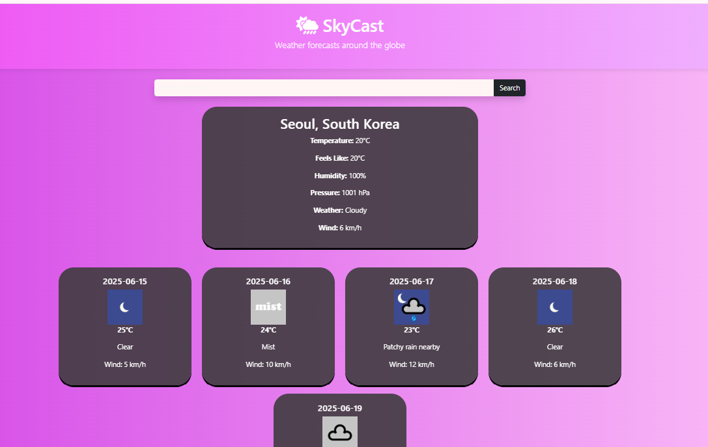

# 🌤️ SkyCast – Responsive Weather Forecast Website

SkyCast is a stylish, mobile-friendly weather web app that shows **real-time current conditions** and **5-day weather forecasts** for any city worldwide. It uses the **WorldWeatherOnline API** for accurate global data and includes smooth CSS animations, a beautiful gradient UI, and modern iconography.

---

## 📸 Preview



---

## ✨ Features

- 🔍 City-based weather search
- 🌡️ Current temperature, pressure, wind, and humidity
- 🗓️ 5-day forecast with weather icons
- 🎨 Gradient background and dark purple-themed cards
- 📱 Responsive design using Bootstrap 5
- ⚡ Animate.css for entrance effects
- ☁️ Weather icons integration

---

## 🚀 Technologies Used

- HTML5 + CSS3
- Bootstrap 5
- JavaScript (ES6)
- Animate.css
- Font Awesome + Weather Icons
- WorldWeatherOnline Weather API

---

## 📂 Project Structure

```

skycast/
├── index.html
├── css/
│   └── style.css
├── js/
│   └── script.js
└── assets/
└── screenshot.png

````

---

## 🔧 Getting Started

### 1. Clone or Download

```bash
git clone https://github.com/yourusername/skycast.git
cd skycast
````

### 2. Get Your API Key

* Go to [WorldWeatherOnline](https://www.worldweatheronline.com/developer/)
* Create a free account and get an API key

### 3. Replace the API Key

In `js/script.js`, replace the placeholder API key:

```js
const apiKey = "your_actual_api_key_here";
```

### 4. Run the App

Just open `index.html` in your browser and start searching!


## 🧑‍💻 Author

**Gajalakshmi**
[🔗 GitHub](https://github.com/gajalakshmi0133)
[🔗 Linkedln](https://www.linkedin.com/in/gajalakshmi-k-201884283/)


